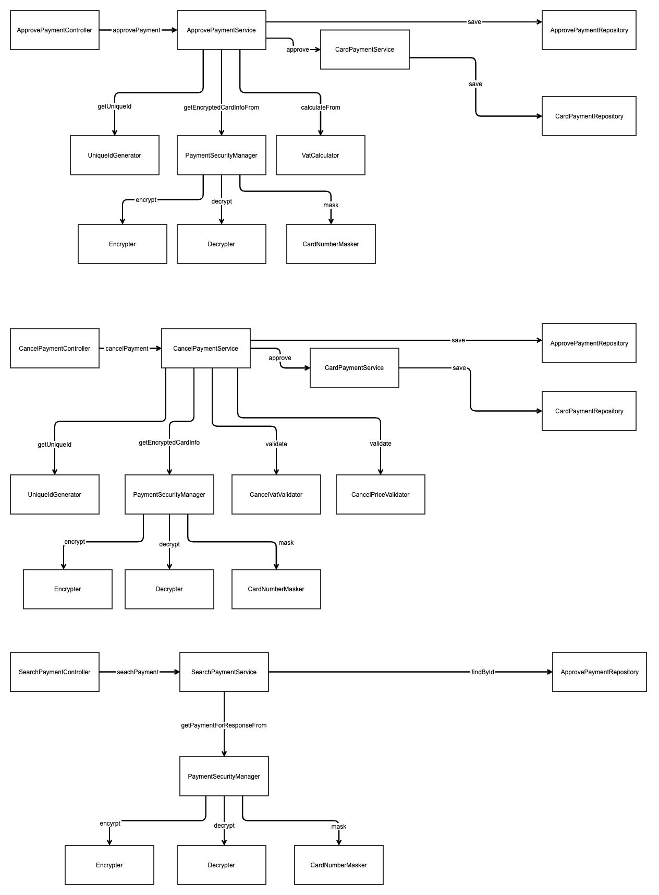

## Goal

결제 요청, 결제 취소 요청, 결제 조회 요청을 받아, 카드사와 통신하는 REST API 를 개발한다.

## Dev Environment

- Java
- Spring Boot
- Swagger
- JPA
- H2
- JUnit

## Message Flow

객체 간 Message Flow 는 아래와 같다. 

객체의 책임 중심으로 설계하였다. 

다른 객체의 도움이 필요하면 객체 간 message 를 주고 받으며, 협력하여 문제를 해결하는데 초점을 두었다.



## Request URL

payments 라는 resource 를 중심으로 request url 을 정의하였으며, 

요청의 행위는 HTTP Method 로 구분한다.

- 결제 요청
  - POST, /payments/v1
- 결제 취소
  - PUT, /payments/v1
- 결제 조회
  - GET, /payments/v1

## Application Package

application 의 package 구조는 아래와 같다. 

사용자의 요청을 처리하는 api package 와, 전체 application 설정을 적용하는 config package, 그리고 doamin package 로 나뉜다.

domain package 는 결제를 담당하는 pay 와, card 정산을 담당하는 card 로 나뉜다. 

- api
  - controller
  - dto
  - handler
- config
- domain
  - card
    - entity
    - repository
    - service
  - pay
    - entity
    - repository
    - service
    - annotation
    - entity
    - enums
    - exception
    - helper

## Build, Run

```java
./gradlew bootRun
```